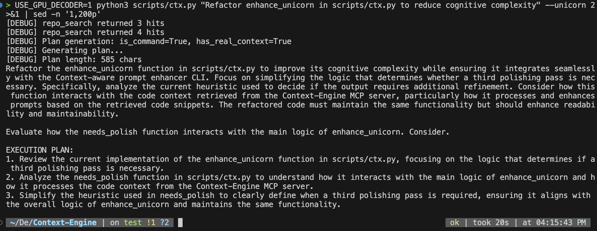
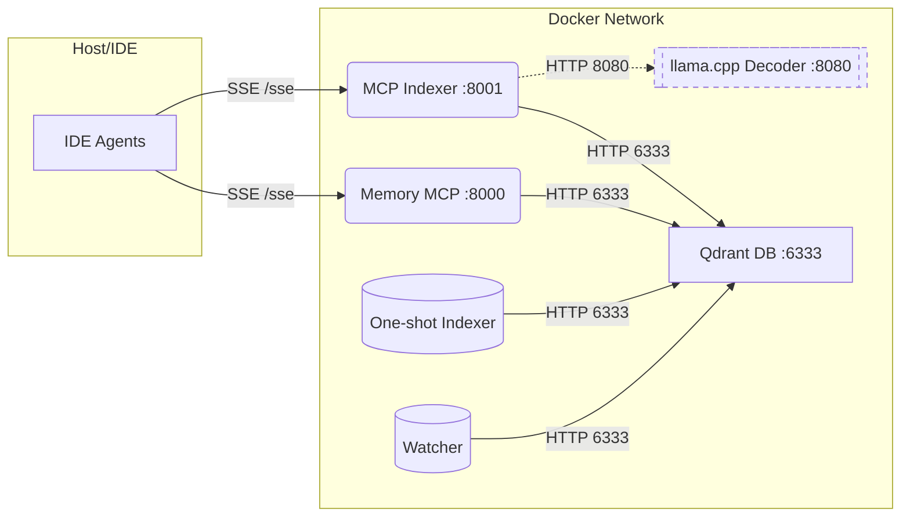

[](https://github.com/m1rl0k/Context-Engine/actions/workflows/ci.yml)

**Documentation:** README · [Configuration](docs/CONFIGURATION.md) · [IDE Clients](docs/IDE_CLIENTS.md) · [MCP API](docs/MCP_API.md) · [ctx CLI](docs/CTX_CLI.md) · [Memory Guide](docs/MEMORY_GUIDE.md) · [Architecture](docs/ARCHITECTURE.md) · [Multi-Repo](docs/MULTI_REPO_COLLECTIONS.md) · [Kubernetes](deploy/kubernetes/README.md) · [VS Code Extension](docs/vscode-extension.md) · [Troubleshooting](docs/TROUBLESHOOTING.md) · [Development](docs/DEVELOPMENT.md)

---

## Context-Engine at a Glance

Context-Engine is a plug-and-play MCP retrieval stack that unifies code indexing, hybrid search, and optional llama.cpp decoding so product teams can ship context-aware agents in minutes, not weeks.

<p align="center">
  
</p>

**Key differentiators**
- One-command bring-up delivers dual SSE/RMCP endpoints, seeded Qdrant, and live watch/reindex loops
- ReFRAG-inspired micro-chunking, token budgeting, and gate-first filtering surface precise spans
- Shared memory/indexer schema and reranker tooling for dense, lexical, and semantic signals
- **ctx CLI prompt enhancer** with multi-pass unicorn mode for code-grounded prompt rewriting
- VS Code extension with Prompt+ button and automatic workspace sync
- Kubernetes deployment with Kustomize for remote/scalable setups
- Performance optimizations: connection pooling, caching, deduplication, async subprocess management

**Built for**
- AI platform and IDE tooling teams needing an MCP-compliant context layer
- DevEx groups standing up internal assistants for large or fast-changing codebases

## Supported Clients

| Client | Transport | Notes |
|--------|-----------|-------|
| Roo | SSE/RMCP | Both SSE and RMCP connections |
| Cline | SSE/RMCP | Both SSE and RMCP connections |
| Windsurf | SSE/RMCP | Both SSE and RMCP connections |
| Zed | SSE | Uses mcp-remote bridge |
| Kiro | SSE | Uses mcp-remote bridge |
| Qodo | RMCP | Direct HTTP endpoints |
| OpenAI Codex | RMCP | TOML config |
| Augment | SSE | Simple JSON configs |
| AmpCode | SSE | Simple URL for SSE endpoints |
| Claude Code CLI | SSE | Simple JSON configs |

> **See [docs/IDE_CLIENTS.md](docs/IDE_CLIENTS.md) for detailed configuration examples.**

## Quickstart (5 minutes)

This gets you from zero to “search works” in under five minutes.

1) Prereqs
- Docker + Docker Compose
- make (optional but recommended)
- Node/npm if you want to use mcp-remote (optional)

2) command (recommended)
```bash
# Provisions tokenizer.json, downloads a tiny llama.cpp model, reindexes, and brings all services up
INDEX_MICRO_CHUNKS=1 MAX_MICRO_CHUNKS_PER_FILE=200 make reset-dev-dual
```
```bash
# Provisions the context-engine for rapid development, 
HOST_INDEX_PATH=. COLLECTION_NAME=codebase docker compose run --rm indexer --root /work --recreate --no-skip-unchanged
```

- Default ports: Memory MCP :8000, Indexer MCP :8001, 8003, Qdrant :6333, llama.cpp :8080

**Seamless Setup Note:**
- The stack uses a **single unified `codebase` collection** by default
- All your code goes into one collection for seamless cross-repo search
- No per-workspace fragmentation - search across everything at once
- Health checks auto-detect and fix cache/collection sync issues
- Just run `make reset-dev-dual` on any machine and it works™

### Make targets: SSE, RMCP, and dual-compat
- Legacy SSE only (default):
  - Ports: 8000 (/sse), 8001 (/sse)
  - Command: `INDEX_MICRO_CHUNKS=1 MAX_MICRO_CHUNKS_PER_FILE=200 make reset-dev`
- RMCP (Codex) only:
  - Ports: 8002 (/mcp), 8003 (/mcp)
  - Command: `INDEX_MICRO_CHUNKS=1 MAX_MICRO_CHUNKS_PER_FILE=200 make reset-dev-codex`
- Dual compatibility (SSE + RMCP together):
  - Ports: 8000/8001 (/sse) and 8002/8003 (/mcp)
  - Command: `INDEX_MICRO_CHUNKS=1 MAX_MICRO_CHUNKS_PER_FILE=200 make reset-dev-dual`

### Environment Setup

```bash
cp .env.example .env  # Copy template on first run
```

Key settings (see [docs/CONFIGURATION.md](docs/CONFIGURATION.md) for full reference):

| Setting | Purpose | Default |
|---------|---------|---------|
| `INDEX_MICRO_CHUNKS=1` | Enable micro-chunking | 0 |
| `REFRAG_DECODER=1` | Enable LLM decoder | 1 |
| `REFRAG_RUNTIME` | Decoder backend | llamacpp |
| `COLLECTION_NAME` | Qdrant collection | codebase |

**GPU acceleration (Apple Silicon):**
```bash
scripts/gpu_toggle.sh gpu    # Switch to native Metal
scripts/gpu_toggle.sh start  # Start GPU decoder
```

### Recommended development flow
1. Bring the stack up with the reset target that matches your client (`make reset-dev`, `make reset-dev-codex`, or `make reset-dev-dual`).
2. When you need a clean ingest (after large edits or when the `qdrant_status` tool/`make qdrant-status` reports zero points), run `make reindex-hard`. This clears `.codebase/cache.json` before recreating the collection so unchanged files cannot be skipped.
3. Confirm collection health with `make qdrant-status` (calls the MCP router to print counts and timestamps).
4. Iterate using search helpers such as `make hybrid ARGS="--query 'async file watcher'"` or invoke the MCP tools directly from your client.

### Apple Silicon Metal GPU (native) vs Docker decoder

On Apple Silicon you can run the llama.cpp decoder natively with Metal while keeping the rest of the stack in Docker:

1. Install the Metal-enabled llama.cpp binary (e.g. `brew install llama.cpp`).
2. Flip to GPU mode and start the native server:
   ```bash
   scripts/gpu_toggle.sh gpu
   scripts/gpu_toggle.sh start   # launches llama-server on localhost:8081
   docker compose up -d --force-recreate mcp_indexer mcp_indexer_http
   docker compose stop llamacpp   # optional once the native server is healthy
   ```
   The toggle updates `.env` to point at `http://host.docker.internal:8081` so containers reach the host process.
3. Run `scripts/gpu_toggle.sh status` to confirm the native server is healthy. All MCP `context_answer` calls will now use the Metal-backed decoder.

Want the original dockerised decoder (CPU-only or x86 GPU fallback)? Swap back with:
```bash
scripts/gpu_toggle.sh docker
docker compose up -d --force-recreate mcp_indexer mcp_indexer_http llamacpp
```
This re-enables the `llamacpp` container and resets `.env` to `http://llamacpp:8080`.

### Make targets (quick reference)
- reset-dev: SSE stack on 8000/8001; seeds Qdrant, downloads tokenizer + tiny llama.cpp model, reindexes, brings up memory + indexer + watcher
- reset-dev-codex: RMCP stack on 8002/8003; same seeding + bring-up for Codex/Qodo
- reset-dev-dual: SSE + RMCP together (8000/8001 and 8002/8003)
- up / down / logs / ps: Docker Compose lifecycle helpers
- index / reindex / reindex-hard: Index current repo; `reindex` recreates the collection; `reindex-hard` also clears the local cache so unchanged files are re-uploaded
- index-here / index-path: Index arbitrary host path without cloning into this repo
- watch: Watch-and-reindex on file changes
- warm / health: Warm caches and run health checks
- hybrid / rerank: Example hybrid search + reranker helper
- setup-reranker / rerank-local / quantize-reranker: Manage ONNX reranker assets and local runs
- prune / prune-path: Remove stale points (missing files or hash mismatch)
- llama-model / tokenizer: Fetch tiny GGUF model and tokenizer.json
- qdrant-status / qdrant-list / qdrant-prune / qdrant-index-root: Convenience wrappers that route through the MCP bridge to inspect or maintain collections


### CLI: ctx prompt enhancer

A CLI that retrieves code context and rewrites your input into a better, code-grounded prompt using the local LLM decoder.

**Features:**
- **Unicorn mode** (`--unicorn`): Multi-pass enhancement with 2-3 refinement stages
- **Detail mode** (`--detail`): Include compact code snippets for richer context
- **Memory blending**: Falls back to stored memories when code search returns no hits
- **Streaming**: Real-time token output for instant feedback
- **Filters**: `--language`, `--under`, `--limit` to scope retrieval

```bash
scripts/ctx.py "What is ReFRAG?"              # Basic question
scripts/ctx.py "Refactor ctx.py" --unicorn    # Multi-pass enhancement
scripts/ctx.py "Add error handling" --detail  # With code snippets
make ctx Q="Explain caching"                  # Via Make target
```

<p align="center">
  
</p>

> **See [docs/CTX_CLI.md](docs/CTX_CLI.md) for full documentation.**

## Index Another Codebase

```bash
# Index a specific path
make index-path REPO_PATH=/path/to/repo [RECREATE=1]

# Index current directory
cd /path/to/repo && make -C /path/to/Context-Engine index-here

# Raw docker compose
docker compose run --rm -v /path/to/repo:/work indexer --root /work --recreate
```

> **See [docs/MULTI_REPO_COLLECTIONS.md](docs/MULTI_REPO_COLLECTIONS.md) for multi-repo architecture and remote deployment.**

## Verify Endpoints

```bash
curl -sSf http://localhost:6333/readyz && echo "Qdrant OK"
curl -sI http://localhost:8001/sse | head -n1   # SSE
curl -sI http://localhost:8003/mcp | head -n1   # RMCP
```

---

## Documentation

| Topic | Description |
|-------|-------------|
| [Configuration](docs/CONFIGURATION.md) | Complete environment variable reference |
| [IDE Clients](docs/IDE_CLIENTS.md) | Setup for Roo, Cline, Windsurf, Zed, Kiro, Qodo, Codex, Augment |
| [MCP API](docs/MCP_API.md) | Full API reference for all MCP tools |
| [ctx CLI](docs/CTX_CLI.md) | Prompt enhancer CLI with unicorn mode |
| [Memory Guide](docs/MEMORY_GUIDE.md) | Memory patterns and metadata schema |
| [Architecture](docs/ARCHITECTURE.md) | System design and component interactions |
| [Multi-Repo](docs/MULTI_REPO_COLLECTIONS.md) | Multi-repository indexing and remote deployment |
| [Kubernetes](deploy/kubernetes/README.md) | Kubernetes deployment with Kustomize |
| [VS Code Extension](docs/vscode-extension.md) | Workspace uploader and Prompt+ integration |
| [Troubleshooting](docs/TROUBLESHOOTING.md) | Common issues and solutions |
| [Development](docs/DEVELOPMENT.md) | Contributing and development setup |

---

## Available MCP Tools

**Memory MCP** (port 8000 SSE, 8002 RMCP):
- `store` — save memories with metadata
- `find` — hybrid memory search

**Indexer MCP** (port 8001 SSE, 8003 RMCP):
- `repo_search` — hybrid code search (dense + lexical + reranker)
- `context_search` — search with optional memory blending
- `context_answer` — Q&A with retrieval + local LLM
- `qdrant_index` / `qdrant_prune` / `qdrant_status` — collection management

> **See [docs/MCP_API.md](docs/MCP_API.md) for complete API documentation.**

## Language Support

Python, JavaScript/TypeScript, Go, Java, Rust, Shell, Terraform, PowerShell, YAML, C#, PHP

## Running Tests

```bash
python3 -m venv .venv && source .venv/bin/activate
pip install -r requirements.txt
pytest -q
```

> **See [docs/DEVELOPMENT.md](docs/DEVELOPMENT.md) for full development setup.**

## Endpoints

| Component | SSE | RMCP |
|-----------|-----|------|
| Memory MCP | http://localhost:8000/sse | http://localhost:8002/mcp |
| Indexer MCP | http://localhost:8001/sse | http://localhost:8003/mcp |
| Qdrant DB | http://localhost:6333 | - |
| Decoder | http://localhost:8080 | - |

> **See [docs/IDE_CLIENTS.md](docs/IDE_CLIENTS.md) for client setup and [docs/TROUBLESHOOTING.md](docs/TROUBLESHOOTING.md) for common issues.**

ReFRAG background: https://arxiv.org/abs/2509.01092

---

## Architecture



> **See [docs/ARCHITECTURE.md](docs/ARCHITECTURE.md) for detailed system design.**

---

## License

MIT

