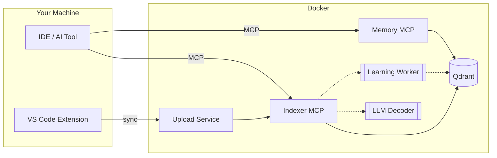

[](https://github.com/m1rl0k/Context-Engine/actions/workflows/ci.yml)
[](https://www.npmjs.com/package/@context-engine-bridge/context-engine-mcp-bridge)
[](https://marketplace.visualstudio.com/items?itemName=context-engine.context-engine-uploader)

**Documentation:** [Getting Started](docs/GETTING_STARTED.md) · README · [Configuration](docs/CONFIGURATION.md) · [IDE Clients](docs/IDE_CLIENTS.md) · [MCP API](docs/MCP_API.md) · [ctx CLI](docs/CTX_CLI.md) · [Memory Guide](docs/MEMORY_GUIDE.md) · [Architecture](docs/ARCHITECTURE.md) · [Multi-Repo](docs/MULTI_REPO_COLLECTIONS.md) · [Kubernetes](deploy/kubernetes/README.md) · [VS Code Extension](docs/vscode-extension.md) · [Troubleshooting](docs/TROUBLESHOOTING.md) · [Development](docs/DEVELOPMENT.md)

---

## Context-Engine

Open-source, self-improving code search that gets smarter every time you use it.

<p align="center">
  
</p>

### Why Context-Engine?

AI coding assistants depend on retrieved context quality. Most solutions use large code chunks, returning entire files for single functions or missing relevant code entirely. Context-Engine uses ReFRAG-inspired micro-chunking (5-50 line spans), hybrid search (semantic + lexical + cross-encoder reranking), and adaptive learning. Runs locally via Docker Compose with any MCP-compatible tool—no cloud dependency, no vendor lock-in.

### What makes it different

| Feature | What it does |
|---------|--------------|
| **Precision Retrieval** | Returns exact code spans (5-50 lines), not whole files |
| **Hybrid Search** | Dense vectors + lexical matching + cross-encoder reranking |
| **MCP Native** | Dual transport (SSE + HTTP) for any AI coding tool |
| **Works Locally** | Docker Compose, runs on your machine |
| **Adaptive** *(optional)* | Learning mode improves ranking from usage patterns |

---

## Quick Start

### 1. Start the stack

```bash
git clone https://github.com/m1rl0k/Context-Engine.git && cd Context-Engine
docker compose up -d
```

### 2. Index your code

**Option A: VS Code Extension (recommended)**

Install [Context Engine Uploader](https://marketplace.visualstudio.com/items?itemName=context-engine.context-engine-uploader) from VS Code Marketplace. Open your project, click "Upload Workspace".

Extension auto-syncs changes and configures MCP clients.

**Option B: CLI**

```bash
HOST_INDEX_PATH=/path/to/your/project docker compose run --rm indexer
```

### 3. Connect your IDE

**HTTP endpoints** — for Claude Code, Windsurf, Qodo, and other RMCP-capable clients:

```json
{
  "mcpServers": {
    "qdrant-indexer": { "url": "http://localhost:8003/mcp" },
    "memory": { "url": "http://localhost:8002/mcp" }
  }
}
```

**stdio via npx (recommended)** — unified bridge with workspace awareness:

```json
{
  "mcpServers": {
    "context-engine": {
      "type": "stdio",
      "command": "npx",
      "args": [
        "@context-engine-bridge/context-engine-mcp-bridge",
        "mcp-serve",
        "--workspace", "/path/to/your/project",
        "--indexer-url", "http://localhost:8003/mcp",
        "--memory-url", "http://localhost:8002/mcp"
      ]
    }
  }
}
```

See [docs/IDE_CLIENTS.md](docs/IDE_CLIENTS.md) for Cursor, Windsurf, Cline, Codex, Augment, and more.

---

## Supported Clients

| Client | Transport |
|--------|-----------|
| Claude Code | SSE / RMCP |
| Cursor | SSE / RMCP |
| Windsurf | SSE / RMCP |
| Cline | SSE / RMCP |
| Roo | SSE / RMCP |
| Augment | SSE |
| Codex | RMCP |
| Copilot | RMCP |
| AmpCode | RMCP |
| Zed | SSE (via mcp-remote) |

---

## Endpoints

| Service | URL |
|---------|-----|
| Indexer MCP (SSE) | `http://localhost:8001/sse` |
| Indexer MCP (RMCP) | `http://localhost:8003/mcp` |
| Memory MCP (SSE) | `http://localhost:8000/sse` |
| Memory MCP (RMCP) | `http://localhost:8002/mcp` |
| Qdrant | `http://localhost:6333` |
| Upload Service | `http://localhost:8004` |

---

## VS Code Extension

[Context Engine Uploader](https://marketplace.visualstudio.com/items?itemName=context-engine.context-engine-uploader) provides:

- **One-click upload** — Sync workspace to Context-Engine
- **Auto-sync** — Watch for changes and re-index automatically
- **Prompt+ button** — Enhance prompts with code context before sending
- **MCP auto-config** — Writes Claude/Windsurf MCP configs

See [docs/vscode-extension.md](docs/vscode-extension.md) for full documentation.

---

## MCP Tools

**Search** (Indexer MCP):
- `repo_search` — Hybrid code search with filters
- `context_search` — Blend code + memory results
- `context_answer` — LLM-generated answers with citations
- `search_tests_for`, `search_config_for`, `search_callers_for`

**Memory** (Memory MCP):
- `store` — Save knowledge with metadata
- `find` — Retrieve stored memories

**Indexing**:
- `qdrant_index_root` — Index the workspace
- `qdrant_status` — Check collection health
- `qdrant_prune` — Remove stale entries

See [docs/MCP_API.md](docs/MCP_API.md) for complete API reference.

---

## Documentation

| Guide | Description |
|-------|-------------|
| [Getting Started](docs/GETTING_STARTED.md) | VS Code + dev-remote walkthrough |
| [IDE Clients](docs/IDE_CLIENTS.md) | Config examples for all supported clients |
| [Configuration](docs/CONFIGURATION.md) | Environment variables reference |
| [MCP API](docs/MCP_API.md) | Full tool documentation |
| [Architecture](docs/ARCHITECTURE.md) | System design |
| [Multi-Repo](docs/MULTI_REPO_COLLECTIONS.md) | Multiple repositories in one collection |
| [Kubernetes](deploy/kubernetes/README.md) | Production deployment |

---

## How It Works



VS Code extension syncs workspace to the stack. IDE talks to MCP servers, which query Qdrant for hybrid search. Optional features: local LLM decoder (llama.cpp), cloud LLM integration (GLM, MiniMax M2), and adaptive learning that improves ranking over time.

---

## Language Support

Python, TypeScript/JavaScript, Go, Java, Rust, C#, PHP, Shell, Terraform, YAML, PowerShell

---

## License

MIT

