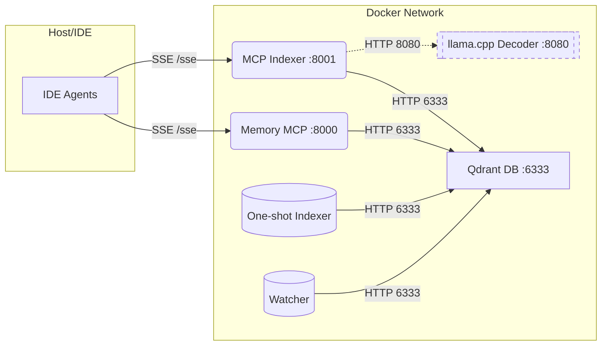

[](https://github.com/m1rl0k/Context-Engine/actions/workflows/ci.yml)

**Documentation:** [Getting Started](docs/GETTING_STARTED.md) · README · [Configuration](docs/CONFIGURATION.md) · [IDE Clients](docs/IDE_CLIENTS.md) · [MCP API](docs/MCP_API.md) · [ctx CLI](docs/CTX_CLI.md) · [Memory Guide](docs/MEMORY_GUIDE.md) · [Architecture](docs/ARCHITECTURE.md) · [Multi-Repo](docs/MULTI_REPO_COLLECTIONS.md) · [Kubernetes](deploy/kubernetes/README.md) · [VS Code Extension](docs/vscode-extension.md) · [Troubleshooting](docs/TROUBLESHOOTING.md) · [Development](docs/DEVELOPMENT.md)

---

## Context-Engine at a Glance

Context-Engine is a plug-and-play MCP retrieval stack that unifies code indexing, hybrid search, and optional llama.cpp decoding so product teams can ship context-aware agents in minutes, not weeks.

<p align="center">
  
</p>

**Key differentiators**
- One-command bring-up delivers dual SSE/RMCP endpoints, seeded Qdrant, and live watch/reindex loops
- ReFRAG-inspired micro-chunking, token budgeting, and gate-first filtering surface precise spans
- **Dynamic query optimization** with adaptive HNSW_EF tuning and intelligent routing for 2x faster simple queries
- **AST-based semantic chunking** preserves function/class boundaries for 20-30% better retrieval precision
- Shared memory/indexer schema and reranker tooling for dense, lexical, and semantic signals
- **ctx CLI prompt enhancer** with multi-pass unicorn mode for code-grounded prompt rewriting
- VS Code extension with Prompt+ button and automatic workspace sync
- Kubernetes deployment with Kustomize for remote/scalable setups
- Performance optimizations: connection pooling, caching, deduplication, async subprocess management

**Built for**
- AI platform and IDE tooling teams needing an MCP-compliant context layer
- DevEx groups standing up internal assistants for large or fast-changing codebases

## Supported Clients

| Client | Transport | Notes |
|--------|-----------|-------|
| Roo | SSE/RMCP | Both SSE and RMCP connections |
| Cline | SSE/RMCP | Both SSE and RMCP connections |
| Windsurf | SSE/RMCP | Both SSE and RMCP connections |
| Zed | SSE | Uses mcp-remote bridge |
| Kiro | SSE | Uses mcp-remote bridge |
| Qodo | RMCP | Direct HTTP endpoints |
| OpenAI Codex | RMCP | TOML config |
| Augment | SSE | Simple JSON configs |
| AmpCode | SSE | Simple URL for SSE endpoints |
| Claude Code CLI | SSE / HTTP (RMCP) | Simple JSON configs via .mcp.json |

> **See [docs/IDE_CLIENTS.md](docs/IDE_CLIENTS.md) for detailed configuration examples.**


## Getting Started

If you're a VS Code user trying Context-Engine locally, start with the low-friction dev-remote + extension guide:

- **[docs/GETTING_STARTED.md](docs/GETTING_STARTED.md)**

The options below describe the `docker compose` + CLI workflows.

### Option 1: Deploy & Connect (Recommended)

Deploy Context-Engine once, connect any IDE. No need to clone this repo into your project.

**1. Start the stack** (on your dev machine or a server):
```bash
git clone https://github.com/m1rl0k/Context-Engine.git && cd Context-Engine
docker compose up -d
```

**2. Index your codebase** (point to any project):
```bash
HOST_INDEX_PATH=/path/to/your/project docker compose run --rm indexer
```

**3. Connect your IDE** — add to your MCP config:
```json
{
  "mcpServers": {
    "context-engine": { "url": "http://localhost:8001/sse" }
  }
}
```

> See [docs/IDE_CLIENTS.md](docs/IDE_CLIENTS.md) for Cursor, Windsurf, Cline, Codex, and other client configs.

### Option 2: Remote Deployment

Run Context-Engine on a server and connect from anywhere.

**Docker on a server:**
```bash
# On server (e.g., context.yourcompany.com)
git clone https://github.com/m1rl0k/Context-Engine.git && cd Context-Engine
docker compose up -d
```

**Index from your local machine:**
```bash
# VS Code extension (recommended) - install, set server URL, click "Upload Workspace"
# Or CLI:
scripts/remote_upload_client.py --server http://context.yourcompany.com:9090 --path /your/project
```

**Connect IDE to remote:**
```json
{ "mcpServers": { "context-engine": { "url": "http://context.yourcompany.com:8001/sse" } } }
```

**Kubernetes:** See [deploy/kubernetes/README.md](deploy/kubernetes/README.md) for Kustomize deployment.

### Option 3: Full Development Setup

For contributors or advanced customization with LLM decoder:

```bash
INDEX_MICRO_CHUNKS=1 MAX_MICRO_CHUNKS_PER_FILE=200 make reset-dev-dual
```

### Default Endpoints

| Service | Port | Use |
|---------|------|-----|
| Indexer MCP | 8001 (SSE), 8003 (RMCP) | Code search, context retrieval |
| Memory MCP | 8000 (SSE), 8002 (RMCP) | Knowledge storage |
| Qdrant | 6333 | Vector database |
| llama.cpp | 8080 | Local LLM decoder |

**Stack behavior:**
- Single `codebase` collection — search across all indexed repos
- Health checks auto-detect and fix cache/collection sync
- Live file watching with automatic reindexing

### Transport Modes
- **SSE** (default): `http://localhost:8001/sse` — Cursor, Cline, Windsurf, Augment
- **RMCP**: `http://localhost:8003/mcp` — Codex, Qodo
- **Dual**: Both SSE + RMCP simultaneously (`make reset-dev-dual`)

### Environment Setup

```bash
cp .env.example .env  # Copy template on first run
```

Key settings (see [docs/CONFIGURATION.md](docs/CONFIGURATION.md) for full reference):

| Setting | Purpose | Default |
|---------|---------|---------|
| `INDEX_MICRO_CHUNKS=1` | Enable micro-chunking | 0 |
| `REFRAG_DECODER=1` | Enable LLM decoder | 1 |
| `REFRAG_RUNTIME` | Decoder backend | llamacpp |
| `COLLECTION_NAME` | Qdrant collection | codebase |

**GPU acceleration (Apple Silicon):**
```bash
scripts/gpu_toggle.sh gpu    # Switch to native Metal
scripts/gpu_toggle.sh start  # Start GPU decoder
```

### Recommended development flow
1. Bring the stack up with the reset target that matches your client (`make reset-dev`, `make reset-dev-codex`, or `make reset-dev-dual`).
2. When you need a clean ingest (after large edits or when the `qdrant_status` tool/`make qdrant-status` reports zero points), run `make reindex-hard`. This clears `.codebase/cache.json` before recreating the collection so unchanged files cannot be skipped.
3. Confirm collection health with `make qdrant-status` (calls the MCP router to print counts and timestamps).
4. Iterate using search helpers such as `make hybrid ARGS="--query 'async file watcher'"` or invoke the MCP tools directly from your client.

### Apple Silicon Metal GPU (native) vs Docker decoder

On Apple Silicon you can run the llama.cpp decoder natively with Metal while keeping the rest of the stack in Docker:

1. Install the Metal-enabled llama.cpp binary (e.g. `brew install llama.cpp`).
2. Flip to GPU mode and start the native server:
   ```bash
   scripts/gpu_toggle.sh gpu
   scripts/gpu_toggle.sh start   # launches llama-server on localhost:8081
   docker compose up -d --force-recreate mcp_indexer mcp_indexer_http
   docker compose stop llamacpp   # optional once the native server is healthy
   ```
   The toggle updates `.env` to point at `http://host.docker.internal:8081` so containers reach the host process.
3. Run `scripts/gpu_toggle.sh status` to confirm the native server is healthy. All MCP `context_answer` calls will now use the Metal-backed decoder.

Want the original dockerised decoder (CPU-only or x86 GPU fallback)? Swap back with:
```bash
scripts/gpu_toggle.sh docker
docker compose up -d --force-recreate mcp_indexer mcp_indexer_http llamacpp
```
This re-enables the `llamacpp` container and resets `.env` to `http://llamacpp:8080`.

### Make targets (quick reference)
- **Setup**: `reset-dev`, `reset-dev-codex`, `reset-dev-dual` - Full stack with SSE, RMCP, or both
- **Lifecycle**: `up`, `down`, `logs`, `ps`, `restart`, `rebuild`
- **Indexing**: `index`, `reindex`, `reindex-hard`, `index-here`, `index-path`
- **Watch**: `watch` (local), `watch-remote` (upload to remote server)
- **Maintenance**: `prune`, `prune-path`, `warm`, `health`, `decoder-health`
- **Search**: `hybrid`, `rerank`, `rerank-local`
- **LLM**: `llama-model`, `tokenizer`, `llamacpp-up`, `setup-reranker`, `quantize-reranker`
- **MCP Tools**: `qdrant-status`, `qdrant-list`, `qdrant-prune`, `qdrant-index-root`
- **Remote**: `dev-remote-up`, `dev-remote-down`, `dev-remote-bootstrap`
- **Router**: `route-plan`, `route-run`, `router-eval`, `router-smoke`
- **CLI**: `ctx Q="your question"` - Prompt enhancement with repo context


### CLI: ctx prompt enhancer

A CLI that retrieves code context and rewrites your input into a better, code-grounded prompt using the local LLM decoder.

**Features:**
- **Unicorn mode** (`--unicorn`): Multi-pass enhancement with 2-3 refinement stages
- **Detail mode** (`--detail`): Include compact code snippets for richer context
- **Memory blending**: Falls back to stored memories when code search returns no hits
- **Streaming**: Real-time token output for instant feedback
- **Filters**: `--language`, `--under`, `--limit` to scope retrieval

```bash
scripts/ctx.py "What is ReFRAG?"              # Basic question
scripts/ctx.py "Refactor ctx.py" --unicorn    # Multi-pass enhancement
scripts/ctx.py "Add error handling" --detail  # With code snippets
make ctx Q="Explain caching"                  # Via Make target
```

<p align="center">
  
</p>

> **See [docs/CTX_CLI.md](docs/CTX_CLI.md) for full documentation.**

## Index Another Codebase

```bash
# Index a specific path
make index-path REPO_PATH=/path/to/repo [RECREATE=1]

# Index current directory
cd /path/to/repo && make -C /path/to/Context-Engine index-here

# Raw docker compose
docker compose run --rm -v /path/to/repo:/work indexer --root /work --recreate
```

> **See [docs/MULTI_REPO_COLLECTIONS.md](docs/MULTI_REPO_COLLECTIONS.md) for multi-repo architecture and remote deployment.**

## Verify Endpoints

```bash
curl -sSf http://localhost:6333/readyz && echo "Qdrant OK"
curl -sI http://localhost:8001/sse | head -n1   # SSE
curl -sI http://localhost:8003/mcp | head -n1   # RMCP
```

---

## Documentation

| Topic | Description |
|-------|-------------|
| [Configuration](docs/CONFIGURATION.md) | Complete environment variable reference |
| [IDE Clients](docs/IDE_CLIENTS.md) | Setup for Roo, Cline, Windsurf, Zed, Kiro, Qodo, Codex, Augment |
| [MCP API](docs/MCP_API.md) | Full API reference for all MCP tools |
| [ctx CLI](docs/CTX_CLI.md) | Prompt enhancer CLI with unicorn mode |
| [Memory Guide](docs/MEMORY_GUIDE.md) | Memory patterns and metadata schema |
| [Architecture](docs/ARCHITECTURE.md) | System design and component interactions |
| [Multi-Repo](docs/MULTI_REPO_COLLECTIONS.md) | Multi-repository indexing and remote deployment |
| [Kubernetes](deploy/kubernetes/README.md) | Kubernetes deployment with Kustomize |
| [VS Code Extension](docs/vscode-extension.md) | Workspace uploader and Prompt+ integration |
| [Troubleshooting](docs/TROUBLESHOOTING.md) | Common issues and solutions |
| [Development](docs/DEVELOPMENT.md) | Contributing and development setup |

---

## Available MCP Tools

**Memory MCP** (port 8000 SSE, 8002 RMCP):
- `store` — save memories with metadata
- `find` — hybrid memory search
- `set_session_defaults` — set default collection for session

**Indexer MCP** (port 8001 SSE, 8003 RMCP):
- **Search**: `repo_search`, `code_search`, `context_search`, `context_answer`
- **Specialized**: `search_tests_for`, `search_config_for`, `search_callers_for`, `search_importers_for`
- **Indexing**: `qdrant_index_root`, `qdrant_index`, `qdrant_prune`
- **Status**: `qdrant_status`, `qdrant_list`, `workspace_info`, `list_workspaces`, `collection_map`
- **Utilities**: `expand_query`, `change_history_for_path`, `set_session_defaults`

> **See [docs/MCP_API.md](docs/MCP_API.md) for complete API documentation.**

## Language Support

Python, JavaScript/TypeScript, Go, Java, Rust, Shell, Terraform, PowerShell, YAML, C#, PHP

## Running Tests

```bash
python3 -m venv .venv && source .venv/bin/activate
pip install -r requirements.txt
pytest -q
```

> **See [docs/DEVELOPMENT.md](docs/DEVELOPMENT.md) for full development setup.**

## Endpoints

| Component | SSE | RMCP |
|-----------|-----|------|
| Memory MCP | http://localhost:8000/sse | http://localhost:8002/mcp |
| Indexer MCP | http://localhost:8001/sse | http://localhost:8003/mcp |
| Qdrant DB | http://localhost:6333 | - |
| Decoder | http://localhost:8080 | - |

> **See [docs/IDE_CLIENTS.md](docs/IDE_CLIENTS.md) for client setup and [docs/TROUBLESHOOTING.md](docs/TROUBLESHOOTING.md) for common issues.**

ReFRAG background: https://arxiv.org/abs/2509.01092

---

## Architecture



> **See [docs/ARCHITECTURE.md](docs/ARCHITECTURE.md) for detailed system design.**

---

## License

MIT

