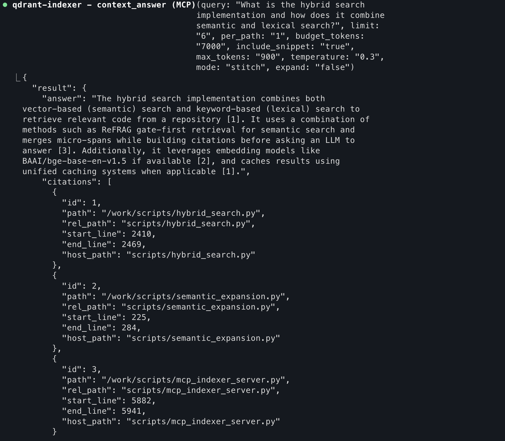
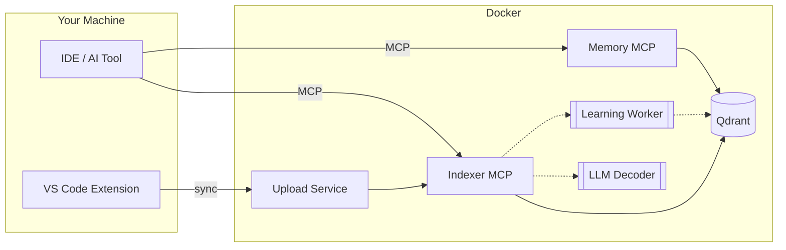

[](https://github.com/m1rl0k/Context-Engine/actions/workflows/ci.yml)
[](https://www.npmjs.com/package/@context-engine-bridge/context-engine-mcp-bridge)
[](https://marketplace.visualstudio.com/items?itemName=context-engine.context-engine-uploader)

**Documentation:** [Getting Started](docs/GETTING_STARTED.md) · README · [Configuration](docs/CONFIGURATION.md) · [IDE Clients](docs/IDE_CLIENTS.md) · [MCP API](docs/MCP_API.md) · [ctx CLI](docs/CTX_CLI.md) · [Memory Guide](docs/MEMORY_GUIDE.md) · [Architecture](docs/ARCHITECTURE.md) · [Multi-Repo](docs/MULTI_REPO_COLLECTIONS.md) · [Kubernetes](deploy/kubernetes/README.md) · [VS Code Extension](docs/vscode-extension.md) · [Troubleshooting](docs/TROUBLESHOOTING.md) · [Development](docs/DEVELOPMENT.md)

---

## Context-Engine

Open-source, self-improving code search that gets smarter every time you use it.

<p align="center">
  
</p>

---

## Quick Start: Stack in 30 Seconds

### VS Code Extension (Easiest)
1. Install [Context Engine Uploader](https://marketplace.visualstudio.com/items?itemName=context-engine.context-engine-uploader)
2. Open any project → extension prompts to set up Context-Engine stack
3. Opened workspace is indexed
4. MCP configs can configure your agent/IDE

**That's it!** The extension handles everything:
- Clones Context-Engine to your chosen location (keeps it separate from your project)
- Starts the Docker stack automatically
- Sets up MCP bridge configuration
- Writes MCP configs for Claude Code, Windsurf, and Augment

### Manual Setup (Alternative)
```bash
git clone https://github.com/m1rl0k/Context-Engine.git && cd Context-Engine
make bootstrap  # One-shot: up → wait → index → warm → health
```

Or step-by-step:
```bash
docker compose up -d
HOST_INDEX_PATH=/path/to/your/project docker compose run --rm indexer
```

*See [Configuration](docs/CONFIGURATION.md) for environment variables and [IDE_CLIENTS.md](docs/IDE_CLIENTS.md) for MCP setup.*

---

## Why This Stack Works Better

| Problem | Context-Engine Solution |
|---------|------------------------|
| **Large file chunks** → returns entire files | **Precise spans**: Returns 5-50 line chunks, not whole files |
| **Lost context** → missing relevant code | **Hybrid search**: Semantic + lexical + cross-encoder reranking |
| **Cloud dependency** → vendor lock-in | **Local stack**: Docker Compose on your machine |
| **Static knowledge** → never improves | **Adaptive learning**: Gets smarter with every use |
| **Tool limits** → only works in specific IDEs | **MCP native**: Works with any MCP-compatible tool |

---

## What You Get Out of the Box

- **ReFRAG-inspired micro-chunking**: Research-grade precision retrieval
- **Self-hosted stack**: No cloud dependency, no vendor lock-in
- **Universal compatibility**: Claude Code, Windsurf, Cursor, Cline, etc.
- **Auto-syncing**: Extension watches for changes and re-indexes automatically
- **Memory system**: Store team knowledge alongside your code
- **Optional LLM features**: Local decoder (llama.cpp), cloud integration (GLM, MiniMax), adaptive rerank learning

### Works With Your Local Files
No complicated path setup - Context-Engine automatically handles the mapping between your local files and the search index.

### Enterprise-Ready Features
- **Built-in authentication** with session management (optional)
- **Unified MCP endpoint** that combines indexer and memory services
- **Automatic collection injection** for workspace-aware queries

**Alternative: Direct HTTP endpoints**
```json
{
  "mcpServers": {
    "qdrant-indexer": { "url": "http://localhost:8003/mcp" },
    "memory": { "url": "http://localhost:8002/mcp" }
  }
}
```

*Using other IDEs? See [docs/IDE_CLIENTS.md](docs/IDE_CLIENTS.md) for complete MCP configuration examples.*

---

## Supported Clients

| Client | Transport |
|--------|-----------|
| Claude Code | SSE / RMCP |
| Cursor | SSE / RMCP |
| Windsurf | SSE / RMCP |
| Cline | SSE / RMCP |
| Roo | SSE / RMCP |
| Augment | SSE |
| Codex | RMCP |
| Copilot | RMCP |
| AmpCode | RMCP |
| Zed | SSE (via mcp-remote) |

---

## Endpoints

| Service | URL |
|---------|-----|
| Indexer MCP (SSE) | `http://localhost:8001/sse` |
| Indexer MCP (RMCP) | `http://localhost:8003/mcp` |
| Memory MCP (SSE) | `http://localhost:8000/sse` |
| Memory MCP (RMCP) | `http://localhost:8002/mcp` |
| Qdrant | `http://localhost:6333` |
| Upload Service | `http://localhost:8004` |

---

## VS Code Extension

[Context Engine Uploader](https://marketplace.visualstudio.com/items?itemName=context-engine.context-engine-uploader) provides:

- **One-click upload** — Sync workspace to Context-Engine
- **Auto-sync** — Watch for changes and re-index automatically
- **Prompt+ button** — Enhance prompts with code context before sending
- **MCP auto-config** — Writes Claude/Windsurf MCP configs

See [docs/vscode-extension.md](docs/vscode-extension.md) for full documentation.

---

## MCP Tools

**Search** (Indexer MCP):
- `repo_search` — Hybrid code search with filters
- `context_search` — Blend code + memory results
- `context_answer` — LLM-generated answers with citations
- `search_tests_for`, `search_config_for`, `search_callers_for`

**Memory** (Memory MCP):
- `store` — Save knowledge with metadata
- `find` — Retrieve stored memories

**Indexing**:
- `qdrant_index_root` — Index the workspace
- `qdrant_status` — Check collection health
- `qdrant_prune` — Remove stale entries

See [docs/MCP_API.md](docs/MCP_API.md) for complete API reference.

---

## Documentation

| Guide | Description |
|-------|-------------|
| [Getting Started](docs/GETTING_STARTED.md) | VS Code + dev-remote walkthrough |
| [IDE Clients](docs/IDE_CLIENTS.md) | Config examples for all supported clients |
| [Configuration](docs/CONFIGURATION.md) | Environment variables reference |
| [MCP API](docs/MCP_API.md) | Full tool documentation |
| [Architecture](docs/ARCHITECTURE.md) | System design |
| [Multi-Repo](docs/MULTI_REPO_COLLECTIONS.md) | Multiple repositories in one collection |
| [Kubernetes](deploy/kubernetes/README.md) | Production deployment |

---

## How It Works



---

## Language Support

Python, TypeScript/JavaScript, Go, Java, Rust, C#, PHP, Shell, Terraform, YAML, PowerShell

---

## License

MIT

