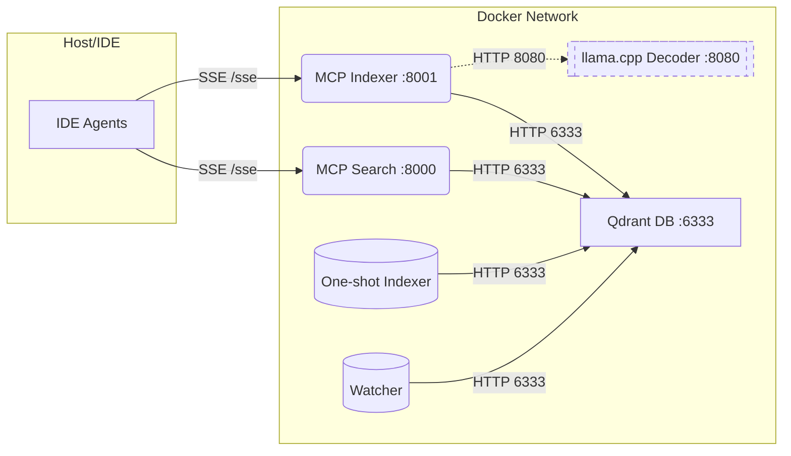

## Quick Start Guide (5 minutes)

This gets you from zero to “search works” in under five minutes.

1) Prereqs
- Docker + Docker Compose
- make (optional but recommended)
- Node/npm if you want to use mcp-remote (optional)

2) One command (recommended)
```bash
# Provisions tokenizer.json, downloads a tiny llama.cpp model, reindexes, and brings all services up
INDEX_MICRO_CHUNKS=1 MAX_MICRO_CHUNKS_PER_FILE=500 make reset-dev
```
- Default ports: Memory MCP :8000, Indexer MCP :8001, Qdrant :6333, llama.cpp :8080

### Make targets: SSE, RMCP, and dual-compat
- Legacy SSE only (default):
  - Ports: 8000 (/sse), 8001 (/sse)
  - Command: `INDEX_MICRO_CHUNKS=1 MAX_MICRO_CHUNKS_PER_FILE=500 make reset-dev`
- RMCP (Codex) only:
  - Ports: 8002 (/mcp), 8003 (/mcp)
  - Command: `INDEX_MICRO_CHUNKS=1 MAX_MICRO_CHUNKS_PER_FILE=500 make reset-dev-codex`
- Dual compatibility (SSE + RMCP together):
  - Ports: 8000/8001 (/sse) and 8002/8003 (/mcp)
  - Command: `INDEX_MICRO_CHUNKS=1 MAX_MICRO_CHUNKS_PER_FILE=500 make reset-dev-dual`

- You can skip the decoder; it’s feature-flagged off by default.

Alternative (compose only)
```bash
HOST_INDEX_PATH="$(pwd)" FASTMCP_INDEXER_PORT=8001 docker compose up -d qdrant mcp mcp_indexer indexer watcher
```

3) Verify endpoints
```bash
curl -sSf http://localhost:6333/readyz >/dev/null && echo "Qdrant OK"
curl -sI http://localhost:8000/sse | head -n1
curl -sI http://localhost:8001/sse | head -n1
```

4) Single command to index + search
```bash
# Fresh index of your repo and a quick hybrid example
make reindex
make hybrid ARGS="--query 'async file watcher' --limit 5 --include-snippet"
```

5) Example MCP client configuration (Kiro)
Create .kiro/settings/mcp.json in your workspace:
````json
{
  "mcpServers": {
    "qdrant-indexer": { "command": "npx", "args": ["mcp-remote", "http://localhost:8001/sse", "--transport", "sse-only"] },
    "qdrant": { "command": "npx", "args": ["mcp-remote", "http://localhost:8000/sse", "--transport", "sse-only"] }
  }
}
````
Notes:
- Kiro expects command/args (stdio). mcp-remote bridges to remote SSE endpoints.
- If npx prompts, add -y right after npx.

6) Common troubleshooting
- Tree-sitter not found or parser errors:
  - Feature is optional. If you set USE_TREE_SITTER=1 and see errors, unset it or install tree-sitter deps, then reindex.
- Tokenizer missing for micro-chunks:
  - Run make tokenizer or set TOKENIZER_JSON to a valid tokenizer.json; otherwise we fall back to line-based chunking.
- SSE “Invalid session ID” when POSTing /messages directly:
  - Expected if you didn’t initiate an SSE session first. Use an MCP client (e.g., mcp-remote) to handle the handshake.
- llama.cpp platform warning on Apple Silicon:
  - Safe to ignore for local dev, or set platform: linux/amd64 for the service, or build a native image.
- Indexing feels stuck on very large files:
  - Use MAX_MICRO_CHUNKS_PER_FILE=500 (default in code) or lower (e.g., 200) during dev runs.


- Watcher timeouts (-9) or Qdrant "ResponseHandlingException: timed out":
  - Set watcher-safe defaults to reduce payload size and add headroom during upserts:

  ````ini
  # Watcher-safe defaults (compose already applies these to the watcher service)
  QDRANT_TIMEOUT=60
  MAX_MICRO_CHUNKS_PER_FILE=200
  INDEX_UPSERT_BATCH=128
  INDEX_UPSERT_RETRIES=5
  INDEX_UPSERT_BACKOFF=0.5
  WATCH_DEBOUNCE_SECS=1.5
  ````

  - If issues persist, try lowering INDEX_UPSERT_BATCH to 96 or raising QDRANT_TIMEOUT to 90.

ReFRAG background: https://arxiv.org/abs/2509.01092

Endpoints

| Component   | URL                          |
|-------------|------------------------------|
| Memory MCP  | http://localhost:8000/sse    |
| Indexer MCP | http://localhost:8001/sse    |
| Qdrant DB   | http://localhost:6333        |


### Streamable HTTP (RMCP) endpoints + OpenAI Codex config

- Memory HTTP (RMCP): http://localhost:8002/mcp
- Indexer HTTP (RMCP): http://localhost:8003/mcp

OpenAI Codex config (RMCP client):

````toml
experimental_use_rmcp_client = true

[mcp_servers.qdrant_memory_http]
url = "http://127.0.0.1:8002/mcp"

[mcp_servers.qdrant_indexer_http/mcp]
url = "http://127.0.0.1:8003/mcp"
````


### Kiro Integration (workspace config)

Add this to your workspace-level Kiro config at `.kiro/settings/mcp.json` (restart Kiro after saving):

````json
{
  "mcpServers": {
    "qdrant-indexer": { "command": "npx", "args": ["mcp-remote", "http://localhost:8001/sse", "--transport", "sse-only"] },
    "qdrant": { "command": "npx", "args": ["mcp-remote", "http://localhost:8000/sse", "--transport", "sse-only"] }
  }
}
````

Notes:
- Kiro expects command/args (stdio). `mcp-remote` bridges to remote SSE endpoints.
- If `npx` prompts in your environment, add `-y` right after `npx`.
- Workspace config overrides user-level config (`~/.kiro/settings/mcp.json`).

Troubleshooting:
- Error: “Enabled MCP Server <name> must specify a command, ignoring.”
  - Fix: Use the `command`/`args` form above; do not use `type:url` in Kiro.
- ImportError: `deps: No module named 'scripts'` when calling `memory_store` on the indexer MCP
  - Fix applied: server now adds `/work` and `/app` to `sys.path`. Restart `mcp_indexer`.

### Qodo Integration (RMCP config)

Add this to your Qodo MCP settings to target the RMCP (HTTP) endpoints:

````json
{
  "mcpServers": {
    "qdrant": { "url": "http://localhost:8002/mcp" },
    "qdrant-indexer": { "url": "http://localhost:8003/mcp" }
  }
}
````

Note: Qodo can talk to the RMCP endpoints directly, so no `mcp-remote` wrapper is required.


## Architecture overview

- Agents connect via MCP over SSE:
  - Memory MCP: http://localhost:8000/sse
  - Indexer MCP: http://localhost:8001/sse
- Both MCP servers talk to Qdrant inside Docker at http://qdrant:6333 (DB HTTP API)
- Supporting jobs (indexer, watcher, init_payload) write to/read from Qdrant directly



## Production-ready local development
## One-line bring-up (ship-ready)

Start Qdrant, the Memory MCP (8000), the Indexer MCP (8001), and run a fresh index of your current repo:

```bash
HOST_INDEX_PATH="$(pwd)" FASTMCP_INDEXER_PORT=8001 docker compose up -d qdrant mcp mcp_indexer indexer watcher
```

Then wire your MCP-aware IDE/tooling to:
- Memory MCP: http://localhost:8000/sse
- Indexer MCP: http://localhost:8001/sse

Tip: add `watcher` to the command if you want live reindex-on-save.

### SSE Memory Server (port 8000)

- URL: http://localhost:8000/sse
- Tools: `store`, `find`
- Env (used by the indexer to blend memory):
  - `MEMORY_SSE_ENABLED=true`
  - `MEMORY_MCP_URL=http://mcp:8000/sse`
  - `MEMORY_MCP_TIMEOUT=6`

IDE/Agent config (recommended):

```json
{
  "mcpServers": {
    "memory": { "type": "sse", "url": "http://localhost:8000/sse", "disabled": false },
    "qdrant-indexer": { "type": "sse", "url": "http://localhost:8001/sse", "disabled": false }
  }
}
```

Blended search:

## Memory usage patterns (how to get the most from memories)

### When to use memories vs code search
- Use memories when the information isn’t in your repository or is transient/user-authored: conventions, runbooks, decisions, links, known issues, FAQs, “how we do X here”.
- Use code search for facts that live in the repo: APIs, functions/classes, configuration, and cross-file relationships.
- Blend both for tasks like “how to run E2E tests” where instructions (memory) reference scripts in the repo (code).
- Rule of thumb: if you’d write it in a team wiki or ticket comment, store it as a memory; if you’d grep for it, use code search.

### Recommended metadata schema (best practices)
We store memory entries as points in Qdrant with a small, consistent payload. Recommended keys:
- kind: "memory" (string) – required. Enables filtering and blending.
- topic: short category string (e.g., "dev-env", "release-process").
- tags: list of strings (e.g., ["qdrant", "indexing", "prod"]).
- source: where this came from (e.g., "chat", "manual", "tool", "issue-123").
- author: who added it (e.g., username or email).
- created_at: ISO8601 timestamp (UTC).
- expires_at: ISO8601 timestamp if this memory should be pruned later.
- repo: optional repo identifier if sharing a Qdrant instance across repos.
- link: optional URL to docs, tickets, or dashboards.
- priority: 0.0–1.0 weight that clients can use to bias ranking when blending.

Notes:
- Keep values small (short strings, small lists). Don’t store large blobs in payload; put details in the `information` text.
- Use lowercase snake_case keys for consistency.
- For secrets/PII: do not store plaintext. Store references or vault paths instead.

### Example memory operations
Store a memory (via MCP Memory server tool `store` – use your MCP client):
```
{
  "information": "Run full reset: INDEX_MICRO_CHUNKS=1 MAX_MICRO_CHUNKS_PER_FILE=500 make reset-dev",
  "metadata": {
    "kind": "memory",
    "topic": "dev-env",
    "tags": ["make", "reset"],
    "source": "chat"
  }
}
```

Find memories (via MCP Memory server tool `find`):
```
{
  "query": "reset-dev",
  "limit": 5
}
```

Blend memories into code search (Indexer MCP `context_search`):
```
{
  "query": "async file watcher",
  "include_memories": true,
  "limit": 5,
  "include_snippet": true
}
```

Tips:
- Use precise queries (2–5 tokens). Add a couple synonyms if needed; the server supports multiple phrasings.
- Combine `topic`/`tags` in your memory text to make them easier to find (they also live in payload for filtering).

### Migrating and backing up memories
Memories are normal Qdrant points (often in the same collection as code). Back them up or migrate using one of these patterns:

1) Snapshot the collection (fastest, whole collection)
- Create snapshot via Qdrant HTTP API, then download the file and store it safely.
  - POST /collections/{collection}/snapshots
  - GET  /collections/{collection}/snapshots/{snapshot}
- Restore by placing the snapshot in Qdrant’s snapshots dir and calling the restore API (see Qdrant docs).

2) Export only memory entries (portable, selective)
- Use qdrant-client to scroll all points where `metadata.kind == "memory"` and write NDJSON; later upsert into another instance.
- Pseudocode:
```
from qdrant_client import QdrantClient, models
c = QdrantClient(url="http://localhost:6333")
filt = models.Filter(must=[models.FieldCondition(key="metadata.kind", match=models.MatchValue(value="memory"))])
# scroll/export all matching points and write to NDJSON; then upsert to import
```

3) Volume-level backup (Docker)
- Archive the Qdrant volume for a full-instance backup:
```
docker run --rm -v qdrant_storage:/data -v "$PWD":/backup alpine sh -c "tar czf /backup/qdrant_storage.tgz /data"
```

Operational notes:
- Collection name comes from `COLLECTION_NAME` (see .env). This stack defaults to a single collection for both code and memories; filtering uses `metadata.kind`.
- If you switch to a dedicated memory collection, update the MCP Memory server and the Indexer’s memory blending env to point at it.
- Consider pruning expired memories by filtering `expires_at < now`.

- Call `context_search` on :8001 with `{ "include_memories": true }` to return both memory and code results.


### Enable memory blending (for context_search)

1) Ensure the Memory MCP is running on :8000 (default in compose).
2) Enable SSE memory blending on the Indexer MCP by setting these env vars for the mcp_indexer service (docker-compose.yml):


````yaml
services:
  mcp_indexer:
    environment:
      - MEMORY_SSE_ENABLED=true
      - MEMORY_MCP_URL=http://mcp:8000/sse
      - MEMORY_MCP_TIMEOUT=6
````


3) Restart the indexer service:

````bash
docker compose up -d mcp_indexer
````


4) Validate by calling context_search with include_memories=true for a query that matches a stored memory:


````json
{
  "query": "your test memory text",
  "include_memories": true,
  "limit": 5
}
````


Expected: non-zero results with blended items; memory hits will have memory-like payloads (e.g., metadata.kind = "memory").


- Idempotent + incremental indexing out of the box:
  - Skips unchanged files automatically using a file content hash stored in payload (metadata.file_hash)
  - De-duplicates per-file points by deleting prior entries for the same path before insert
  - Payload indexes are auto-created on first run (metadata.language, metadata.path_prefix, metadata.repo, metadata.kind, metadata.symbol, metadata.symbol_path, metadata.imports, metadata.calls)
- Commands:
  - Full rebuild: `make reindex`
  - Fast incremental: `make index` (skips unchanged files)
  - Health check: `make health` (verifies collection vector name/dim, HNSW, and filtered queries with kind/symbol)
  - Hybrid search: `make hybrid` (dense + lexical bump with RRF)
- Bootstrap all services + index + checks: `make bootstrap`
- Discover commands: `make help` lists all targets and descriptions

- Ingest Git history: `make history` (messages + file lists)
  - If the repo has no local commits yet, the history ingester will shallow-fetch from the remote (default: origin) and use its HEAD. Configure with `--remote` and `--fetch-depth`.
- Local reranker (ONNX): `make rerank-local` (set RERANKER_ONNX_PATH and RERANKER_TOKENIZER_PATH)
- Setup ONNX reranker quickly: `make setup-reranker ONNX_URL=... TOKENIZER_URL=...` (updates .env paths)
- Enable Tree-sitter parsing (more accurate symbols/scopes): set `USE_TREE_SITTER=1` in `.env` then reindex

- Flags (advanced):
  - Disable de-duplication: `docker compose run --rm indexer --root /work --no-dedupe`
  - Disable unchanged skipping: `docker compose run --rm indexer --root /work --no-skip-unchanged`

Notes:
- Named vector remains aligned with the MCP server (fast-bge-base-en-v1.5). If you change EMBEDDING_MODEL, run `make reindex` to recreate the collection.
- For very large repos, consider running `make index` on a schedule (or pre-commit) to keep Qdrant warm without full reingestion.

### Multi-query re-ranker (no new deps)

- Run a fused query with several phrasings and metadata-aware boosts:

```bash
make rerank
```

- Customize:
  - Add more `--query` flags
  - Prefer language: `--language python`
  - Prefer under path: `--under /work/scripts`

### Watch mode (incremental indexing)

- Reindex changed files on save (runs until Ctrl+C):

```bash
make watch
```

### HNSW recall tuning

- Collection creation is tuned for higher recall: `m=16`, `ef_construct=256`.
- If you change embeddings, run `make reindex` to recreate the collection with the tuned HNSW settings.

### Warm start (optional)

- Preload the embedding model and warm Qdrant's HNSW search path to reduce first-query latency and improve recall:

```bash
make warm
```


Or, since this stack already exposes SSE, you can configure the client to use `http://localhost:8000/sse` directly (recommended for Cursor/Windsurf).

### MCP `qdrant-find` optional filters

Most MCP clients let you pass structured tool arguments. The Qdrant MCP server supports applying server-side filters when these keys are present:
- `language`: value matches `metadata.language`
- `path_prefix`: value matches `metadata.path_prefix` (e.g., `/work/src`)
- `kind`: value matches `metadata.kind` (e.g., `function`, `class`, `method`)

Tip: Combine multiple query phrasings and apply these filters for best precision on large codebases.


## Notes

## Index your repository (code search quality)

We added a dockerized indexer that chunks code, embeds with `BAAI/bge-base-en-v1.5`, and stores metadata (`path`, `path_prefix`, `language`, `start_line`, `end_line`, `code`) in Qdrant. This boosts recall and relevance for the MCP tools.

```bash
# Index current workspace (does not drop data)
make index

# Full reindex (drops existing points in the collection)
make reindex

### Companion MCP: Index/Prune/List (Option B)

A second MCP server runs alongside the search MCP and exposes tools:
- qdrant-list: list collections
- qdrant-index: index the mounted path (/work or subdir)
- qdrant-prune: prune stale points for the mounted path

Configuration
- FASTMCP_INDEXER_PORT (default 8001)
- HOST_INDEX_PATH bind-mounts the target repo into /work (read-only)

Add to your agent as a separate MCP endpoint (SSE):
- URL: http://localhost:8001/sse

Example calls (semantics vary by client):
- qdrant-index with args {"subdir":"scripts","recreate":true}

### MCP client configuration examples

Windsurf/Cursor (stdio for search + SSE for indexer):

```json
{
  "mcpServers": {
    "qdrant": {
      "command": "uvx",
      "args": ["mcp-server-qdrant"],
      "env": {
        "QDRANT_URL": "http://localhost:6333",
        "COLLECTION_NAME": "my-collection",
        "EMBEDDING_MODEL": "BAAI/bge-base-en-v1.5"
      },
      "disabled": false
    }
  }
}
```

Augment (SSE for both servers – recommended):

```json
{
  "mcpServers": {
    "qdrant": { "type": "sse", "url": "http://localhost:8000/sse", "disabled": false },
    "qdrant-indexer": { "type": "sse", "url": "http://localhost:8001/sse", "disabled": false }
  }
}
```

Qodo (Remote MCPs use simplified format - add each tool individually):

**Note**: In Qodo, you must add each MCP tool separately through the UI, not as a single JSON config.

For each tool, use this format:

**Tool 1 - qdrant:**
```json
{
  "qdrant": { "url": "http://localhost:8000/sse" }
}
```

**Tool 2 - qdrant-indexer:**
```json
{
  "qdrant-indexer": { "url": "http://localhost:8001/sse" }
}
```

#### Important for IDE agents (Cursor/Windsurf/Augment)
- Do not send null values to MCP tools. Omit the field or pass an empty string "" instead.
- qdrant-index examples:
  - {"subdir":"","recreate":false,"collection":"my-collection","repo_name":"workspace"}
  - {"subdir":"scripts","recreate":true}
- For indexing the repo root with no params, use the zero-arg tool `qdrant_index_root` (new) or call `qdrant-index` with `subdir:""`.


##### Zero-config search tool (new)
- repo_search: run code search without filters or config.
  - Structured fields supported (parity with DSL): language, under, kind, symbol, ext, not_, case, path_regex, path_glob, not_glob
  - Response shaping: compact (bool) returns only path/start_line/end_line
  - Smart default: compact=true when query is an array with multiple queries (unless explicitly set)
  - If include_snippet is true, compact is forced off so snippet fields are returned

  - Glob fields accept a single string or an array; you can also pass a comma-separated string which will be split
  - Query parsing: accepts query or queries; JSON arrays, JSON-stringified arrays, comma-separated strings; also supports q/text aliases

  - Parity note: path_glob/not_glob list handling works in both modes — in-process and subprocess — with OR semantics for path_glob and reject-on-any for not_glob.
  - Examples:
    - {"query": "semantic chunking"}
    - {"query": ["function to split code", "overlapping chunks"], "limit": 15, "per_path": 3}
    - {"query": "watcher debounce", "language": "python", "under": "scripts/", "include_snippet": true, "context_lines": 2}
    - {"query": "parser", "ext": "ts", "path_regex": "/services/.+", "compact": true}
    - {"query": "adapter", "path_glob": ["**/src/**", "**/pkg/**"], "not_glob": "**/tests/**"}
  - Returns structured results: score, path, symbol, start_line, end_line, and optional snippet; or compact form.
- code_search: alias of repo_search (same args) for easier discovery in some clients.

- qdrant_status: return collection size and last index times (safe, read-only).
  - {"collection": "my-collection"}


Verification:
- You should see tools from both servers (e.g., `store`, `find`, `repo_search`, `code_search`, `context_search`, `qdrant_list`, `qdrant_index`, `qdrant_prune`, `qdrant_status`).
- Call `qdrant_list` to confirm Qdrant connectivity.
- Call `qdrant_index` with args like `{ "subdir": "scripts", "recreate": true }` to (re)index the mounted repo.
- Call `context_search` with `{ "include_memories": true }` to blend memory+code (requires enabling MEMORY_SSE_ENABLED on the indexer service).

- qdrant_list with no args
- qdrant_prune with no args


Notes:
- The indexer reads env from `.env` (QDRANT_URL, COLLECTION_NAME, EMBEDDING_MODEL).
- Default chunking: ~120 lines with 20-line overlap.
- Skips typical build/venv directories.
- Populates `metadata.kind`, `metadata.symbol`, and `metadata.symbol_path` for Python/JS/TS/Go/Java/Rust/Terraform (best-effort), per chunk.
- Uses the same collection as the MCP server.

### Exclusions (.qdrantignore) and defaults

- The indexer now supports a `.qdrantignore` file at the repo root (similar to `.gitignore`). Use it to exclude directories/files from indexing.
- Sensible defaults are excluded automatically (overridable): `/models`, `/node_modules`, `/dist`, `/build`, `/.venv`, `/venv`, `/__pycache__`, `/.git`, and files matching `*.onnx`, `*.bin`, `*.safetensors`, `tokenizer.json`, `*.whl`, `*.tar.gz`.
- Override via env or flags:
  - Env: `QDRANT_DEFAULT_EXCLUDES=0` to disable defaults; `QDRANT_IGNORE_FILE=.myignore`; `QDRANT_EXCLUDES='tokenizer.json,*.onnx,/third_party'`
  - CLI examples:
    - `docker compose run --rm indexer --root /work --ignore-file .qdrantignore`
    - `docker compose run --rm indexer --root /work --no-default-excludes --exclude '/vendor' --exclude '*.bin'`

### Scaling and tuning (small → large codebases)

- Chunking and batching are tunable via env or flags:
  - `INDEX_CHUNK_LINES` (default 120), `INDEX_CHUNK_OVERLAP` (default 20)
  - `INDEX_BATCH_SIZE` (default 64)
  - `INDEX_PROGRESS_EVERY` (default 200 files; 0 disables)
### Prune stale points (optional)

If files were deleted or significantly changed outside the indexer, remove stale points safely:

```bash
make prune
```

- CLI equivalents: `--chunk-lines`, `--chunk-overlap`, `--batch-size`, `--progress-every`.
- Recommendations:
  - Small repos (<100 files): chunk 80–120, overlap 16–24, batch-size 32–64
  - Medium (100s–1k files): chunk 120–160, overlap ~20, batch-size 64–128
  - Large monorepos (1k+): start with defaults; consider `INDEX_PROGRESS_EVERY=200` for visibility and `INDEX_BATCH_SIZE=128` if RAM allows


## ReFRAG micro-chunking (retrieval-side, production-ready)

ReFRAG-lite is enabled in this repo and can be toggled via env. It provides:
- Token-level micro-chunking at ingest (tiny k-token windows with stride)
- Compact vector gating and optional gate-first candidate restriction
- Span compaction and a global token budget at search time

Enable and tune:

````ini
# Enable compressed retrieval with micro-chunks
REFRAG_MODE=1
INDEX_MICRO_CHUNKS=1

# Micro windowing
MICRO_CHUNK_TOKENS=16
MICRO_CHUNK_STRIDE=8

# Output shaping and budget
MICRO_OUT_MAX_SPANS=3
MICRO_MERGE_LINES=4
MICRO_BUDGET_TOKENS=512
MICRO_TOKENS_PER_LINE=32

# Optional: gate-first using mini vectors to prefilter dense search
REFRAG_GATE_FIRST=0
REFRAG_CANDIDATES=200
````

Reindex after changing chunking:

````bash
# Recreate collection (safe for local dev)
docker compose exec mcp_indexer python -c "from scripts.mcp_indexer_server import qdrant_index_root; qdrant_index_root(recreate=True)"
````

What results look like (context_search / code_search return shape):

````json
{
  "score": 0.9234,
  "path": "scripts/ingest_code.py",
  "start_line": 120,
  "end_line": 148,
  "span_budgeted": true,
  "budget_tokens_used": 224,
  "components": { "dense": 0.78, "lex": 0.35, "mini": 0.81 },
  "why": ["dense", "mini"]
}
````

Notes:
- span_budgeted=true indicates adjacent micro hits were merged and counted toward the global token budget.
- Tune MICRO_* to control prompt footprint. Increase MICRO_MERGE_LINES to merge looser spans; reduce MICRO_OUT_MAX_SPANS for more file diversity.
- Gate-first reduces dense search compute on large collections; keep off for tiny repos.


## Decoder-path ReFRAG (feature-flagged)

This stack ships a feature-flagged decoder integration path via a llama.cpp sidecar.
It is production-safe by default (off) and can run in a fallback “prompt” mode
that uses a compressed textual context. A future “soft” mode will inject projected
chunk embeddings into a patched llama.cpp server.


### Decoder-path dataflow (compress → sense → expand)


Enable (safe default is off):

````ini
REFRAG_DECODER=1
REFRAG_RUNTIME=llamacpp
LLAMACPP_URL=http://llamacpp:8080
REFRAG_DECODER_MODE=prompt  # prompt|soft (soft requires patched llama.cpp)
REFRAG_ENCODER_MODEL=BAAI/bge-base-en-v1.5
REFRAG_PHI_PATH=/work/models/refrag_phi_768_to_dmodel.bin
````

Bring up llama.cpp sidecar (optional):

````bash
docker compose up -d llamacpp
````

Make-based provisioning (recommended):

````bash
# downloads a tiny GGUF to ./models/model.gguf (override URL via LLAMACPP_MODEL_URL)
make llamacpp-up
# or just fetch the model without starting the service
make llama-model
````

Optional: bake the model into the image (no host volume required):

````bash
# builds an image that includes the model specified by MODEL_URL
make llamacpp-build-image LLAMACPP_MODEL_URL=https://huggingface.co/.../tiny.gguf
# then in docker-compose.yml, either remove the ./models volume for llamacpp
# or override the service to use image: context-llamacpp:tiny
````


Programmatic use:

````python
from scripts.refrag_llamacpp import LlamaCppRefragClient
c = LlamaCppRefragClient()  # uses LLAMACPP_URL
text = c.generate_with_soft_embeddings("Question: ...\n", soft_embeddings=None, max_tokens=128)
````


Notes:
- φ file format: JSON 2D array with shape (d_in, d_model). See scripts/refrag_phi.py. Set REFRAG_PHI_PATH to your JSON file.

- In prompt mode, the client calls /completion on the llama.cpp server with a compressed prompt.
- In soft mode, the client will require a patched server to accept soft embeddings. The flag ensures no breakage.

### MCP search filtering (language, path, kind)

- The indexer creates payload indexes for efficient filtering.
- When querying (via MCP client or scripts), you can filter by:
  - `metadata.language` (e.g., python, typescript, javascript, go, rust)
  - `metadata.path_prefix` (e.g., `/work/src`)
  - `metadata.kind` (e.g., function, class, method)
- Example: in the provided reranker script you can do:

```bash
make rerank ARGS="--language python --under /work/scripts"

### Operational safeguards and troubleshooting

- Tokenizer for micro-chunking: set TOKENIZER_JSON to a valid tokenizer.json path (default: models/tokenizer.json). If missing, the indexer falls back to line-based chunking.
- Cap micro-chunks per file: MAX_MICRO_CHUNKS_PER_FILE (default 2000) to prevent runaway chunk counts on very large files.
- Qdrant client timeout: QDRANT_TIMEOUT (seconds, default 20) applies to all MCP Qdrant calls.
- Memory auto-detect caching: MEMORY_AUTODETECT=1 by default with MEMORY_COLLECTION_TTL_SECS (default 300s) to avoid repeatedly sampling all collections.
- Schema repair: ensure_collection now repairs missing named vectors (lex, and mini when REFRAG_MODE=1) on existing collections.

```

- Direct Qdrant filter example is shown below; most MCP clients allow passing tool args that map to server-side filters. If your client supports adding structured args to `qdrant-find`, prefer these filters to reduce noise.


### Payload indexes (created for you)

We create payload indexes to accelerate filtered searches:
- `metadata.language` (keyword)
- `metadata.path_prefix` (keyword)
- `metadata.repo` (keyword)
- `metadata.kind` (keyword)
- `metadata.symbol` (keyword)
- `metadata.symbol_path` (keyword)
- `metadata.imports` (keyword)
- `metadata.calls` (keyword)
- `metadata.file_hash` (keyword)
- `metadata.ingested_at` (keyword)
- Git history fields available in payload: `commit_id`, `author_name`, `authored_date`, `message`, `files`

This enables fast filters like “only Python results under scripts/”. Example (Qdrant REST):

```bash
curl -s -X POST "http://localhost:6333/collections/my-collection/points/search" \
  -H 'Content-Type: application/json' \
  -d '{
    "vector": {"name": "fast-bge-base-en-v1.5", "vector": [0, ...]},
### Kind/Symbol filters example

- After indexing, you can filter by symbol metadata for tighter queries. Example with reranker:

```bash
make rerank ARGS="--language python --under /work/scripts"
```

- Direct Qdrant query (Python):

```python
from qdrant_client import QdrantClient, models
client = QdrantClient(url="http://localhost:6333")
flt = models.Filter(must=[
    models.FieldCondition(key="metadata.language", match=models.MatchValue(value="python")),
    models.FieldCondition(key="metadata.kind", match=models.MatchValue(value="function")),
])
```

    "limit": 5,
    "with_payload": true,
    "filter": {
      "must": [
        {"key": "metadata.language", "match": {"value": "python"}},
        {"key": "metadata.path_prefix", "match": {"value": "/work/scripts"}}
      ]
    }
  }'
```

Note: The named vector for BGE in this stack is `fast-bge-base-en-v1.5`.

### Best-practice querying

- Use precise intent + language: “python chunking function for Qdrant indexing”
- Add path hints when you know the area: “under scripts or ingestion code”
- Try 2–3 alternative phrasings (multi-query) and pick the consensus
- Prefer results where `metadata.language` matches your target file
- For navigation, prefer results where `metadata.path_prefix` matches your directory

Client tips:
- MCP tools: issue multiple finds with variant phrasings and re-rank by score + metadata match
- Direct Qdrant: use `vector={name: ..., vector: ...}` with the named vector above


- Data persists in the `qdrant_storage` Docker volume.
- The MCP server uses SSE transport and will auto-create the collection if it doesn't exist.
- Only FastEmbed models are supported at this time.

## Troubleshooting

- If the MCP servers can’t reach Qdrant, confirm both containers are up: `make ps`.
- If the SSE port collides, change `FASTMCP_PORT` in `.env` and the mapped port in `docker-compose.yml`.
- If you customize tool descriptions, restart: `make restart`.
