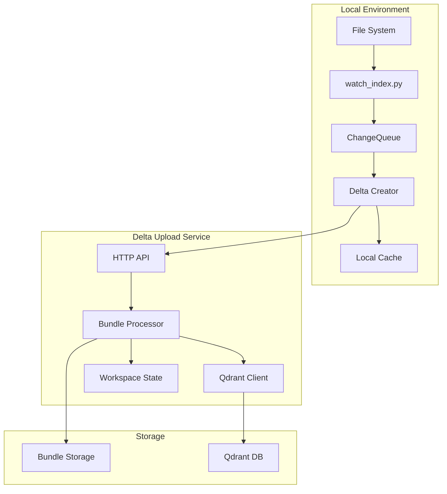
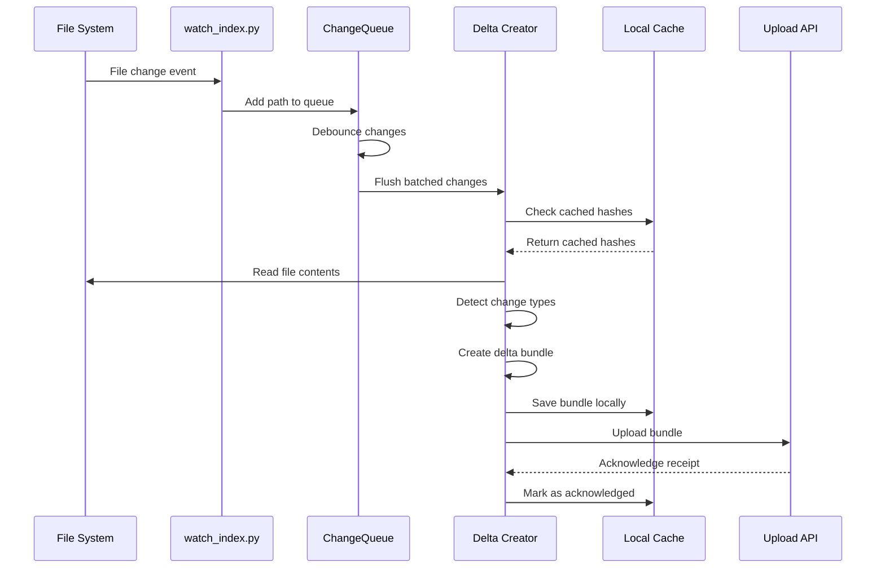
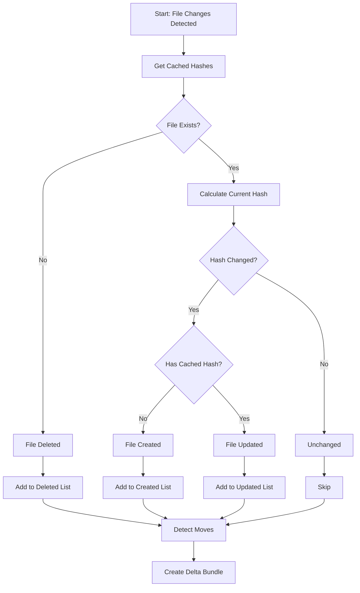
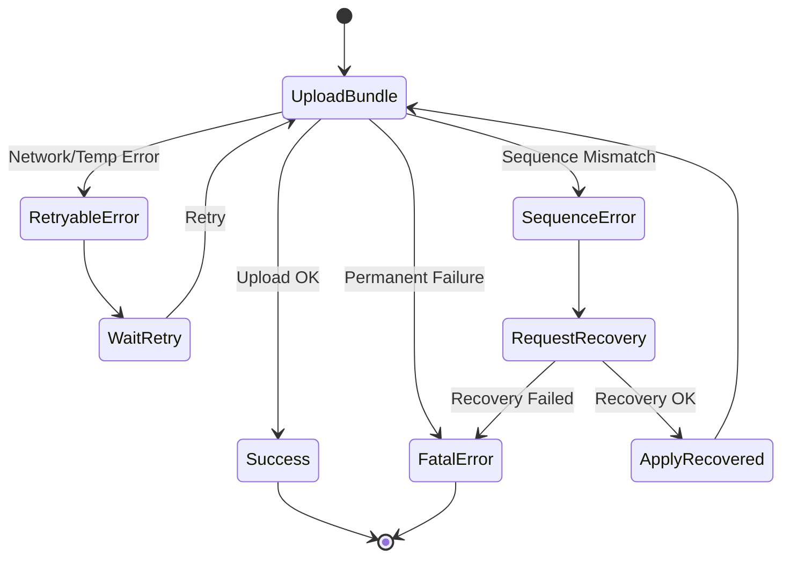
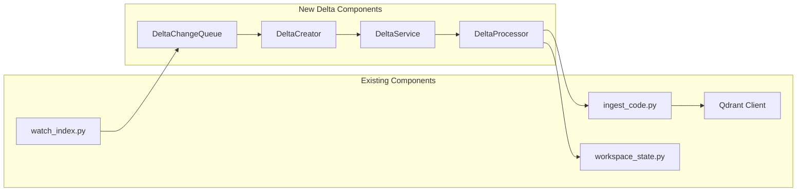
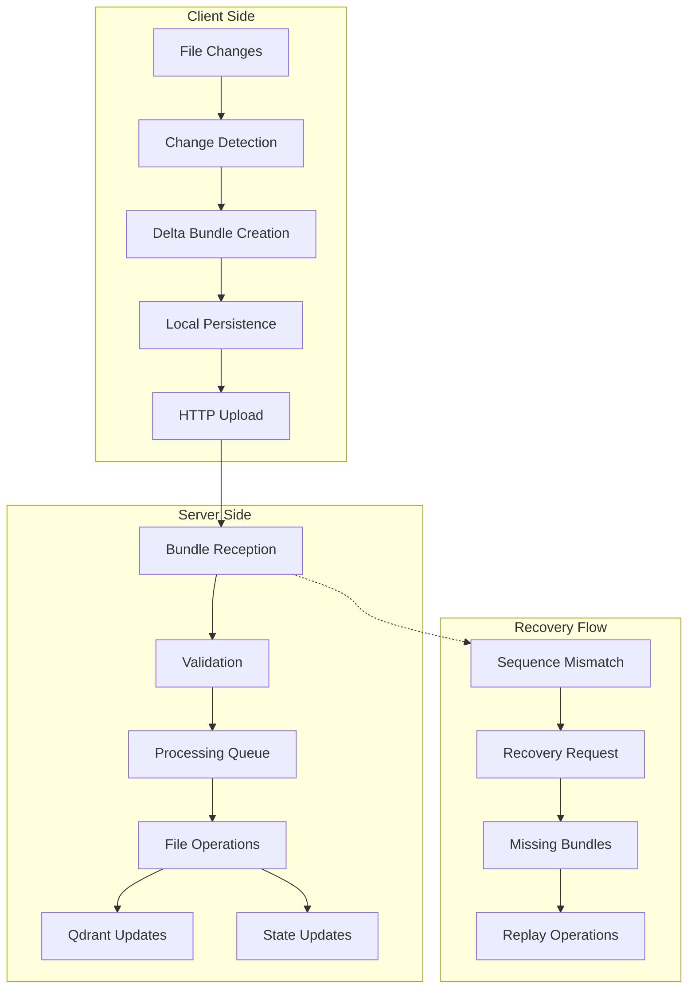
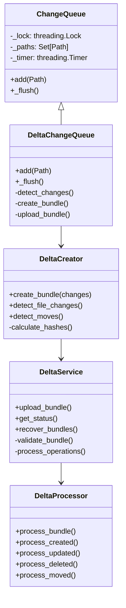
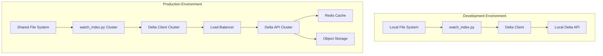

# Delta Upload System Architecture

## System Overview

## Delta Bundle Creation Flow

## Change Detection Algorithm

## Error Recovery Flow

## Integration Points

## Data Flow Architecture

## Component Interactions

## Deployment Architecture

This architecture provides a comprehensive view of how the delta upload system integrates with the existing Context-Engine infrastructure while providing scalability, reliability, and efficient change detection.