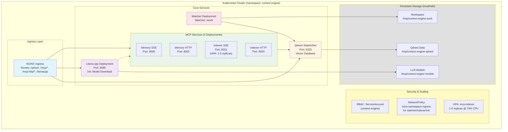

# Kubernetes Deployment Guide

**Documentation:** [README](../../README.md) · [Configuration](../../docs/CONFIGURATION.md) · [IDE Clients](../../docs/IDE_CLIENTS.md) · [MCP API](../../docs/MCP_API.md) · [ctx CLI](../../docs/CTX_CLI.md) · [Memory Guide](../../docs/MEMORY_GUIDE.md) · [Architecture](../../docs/ARCHITECTURE.md) · [Multi-Repo](../../docs/MULTI_REPO_COLLECTIONS.md) · Kubernetes · [VS Code Extension](../../docs/vscode-extension.md) · [Troubleshooting](../../docs/TROUBLESHOOTING.md) · [Development](../../docs/DEVELOPMENT.md)

---

## Overview

This directory contains Kubernetes manifests for deploying Context Engine on a remote cluster using **Kustomize**. This enables:

- **Remote development** from thin clients with cluster-based heavy lifting
- **Multi-repository indexing** with unified `codebase` collection
- **Scalable architecture** with independent watcher deployments per repo
- **Kustomize-based configuration** for easy customization and overlays

## Architecture



## Quick Start

### Prerequisites

- Kubernetes cluster (1.19+)
- `kubectl` configured to access your cluster
- `kustomize` (optional, kubectl has built-in support)
- Docker image built and pushed to a registry

### 1. Build and Push Image

```bash
# Build unified image
docker build -t your-registry/context-engine:latest .

# Push to registry
docker push your-registry/context-engine:latest
```

### 2. Update Image References

Edit `kustomization.yaml` to use your registry:

```yaml
images:
  - name: context-engine
    newName: your-registry/context-engine
    newTag: latest
```

### 3. Deploy Using Kustomize

```bash
# Option 1: Using the deploy script with Kustomize (recommended)
./deploy.sh --use-kustomize --registry your-registry/context-engine --tag latest --deploy-ingress

# Option 2: Using kubectl with kustomize directly
kubectl apply -k .

# Option 3: Using kustomize CLI
kustomize build . | kubectl apply -f -

# Option 4: Using the deploy script without Kustomize (legacy)
./deploy.sh --registry your-registry/context-engine --tag latest --deploy-ingress
```

**Deploy Script Flags:**
- `--use-kustomize`: Use Kustomize for declarative image management (recommended)
- `--registry <registry/name>`: Docker registry and image name (default: context-engine)
- `--tag <tag>`: Image tag (default: latest)
- `--deploy-ingress`: Deploy NGINX ingress routes
- `--skip-llamacpp`: Skip llama.cpp decoder deployment

### 4. Deploy Using Makefile

```bash
# Deploy all services
make deploy

# Or deploy core services only
make deploy-core

# Check status
make status
```

### 5. Verify Deployment

```bash
# Check all pods are running
kubectl get pods -n context-engine

# Check services
kubectl get svc -n context-engine

# View logs
make logs-service SERVICE=mcp-memory
```

### 6. Access Services

```bash
# Port forward to localhost
make port-forward

# Or access via NodePort
# Qdrant: http://<node-ip>:30333
# MCP Memory: http://<node-ip>:30800
# MCP Indexer: http://<node-ip>:30802
```

## Configuration

### Automatic Model Download

The Llama.cpp deployment includes an **init container** that automatically downloads the model on first startup:

- **Default Model**: Qwen2.5-1.5B-Instruct (Q8_0 quantization, ~1.7GB)
- **Download Location**: `/tmp/context-engine-models/` on the Kubernetes node
- **Behavior**: Downloads only if model doesn't exist (idempotent)
- **Good balance**: Fast, accurate, small footprint

To use a different model, edit `configmap.yaml`:

```yaml
# Model download configuration
LLAMACPP_MODEL_URL: "https://huggingface.co/your-org/your-model/resolve/main/model.gguf"
LLAMACPP_MODEL_NAME: "model.gguf"
```

**Alternative Models**:
- **Qwen2.5-0.5B-Instruct-Q8** (~500MB) - Tiny, very fast
- **Qwen2.5-1.5B-Instruct-Q8** (default, ~1.7GB) - Best balance
- **Granite-3.0-3B-Instruct-Q8** (~3.2GB) - Higher quality
- **Phi-3-mini-4k-instruct-Q8** (~4GB) - High quality

### Environment Variables (ConfigMap)

Key environment variables in `configmap.yaml`:

```yaml
COLLECTION_NAME: "codebase"           # Unified collection for all repos
EMBEDDING_MODEL: "BAAI/bge-base-en-v1.5"
QDRANT_URL: "http://qdrant:6333"
INDEX_MICRO_CHUNKS: "1"
MAX_MICRO_CHUNKS_PER_FILE: "200"
WATCH_DEBOUNCE_SECS: "1.5"
```

#### Syncing `configmap.yaml` from `.env`

If you treat a `.env` file as the source of truth for configuration, you can use the helper script `scripts/sync_env_to_k8s.py` to keep `deploy/kubernetes/configmap.yaml` and the workloads in sync:

```bash
cd /path/to/Context-Engine
python3 scripts/sync_env_to_k8s.py --env-file .env --k8s-dir deploy/kubernetes
```

This will:

- Regenerate `deploy/kubernetes/configmap.yaml` so its `data:` keys match the provided `.env` (excluding sensitive keys such as `GLM_API_KEY` by default).
- Ensure all Deployments and Jobs in `deploy/kubernetes/` include:

  ```yaml
  envFrom:
    - configMapRef:
        name: context-engine-config
  ```

In CI (for example Bamboo), you can run the same script against the workspace copy of the manifests before `kustomize build . | kubectl apply -f -`, and then provide any sensitive values (such as `GLM_API_KEY`) via Kubernetes `Secret` resources or per-environment overrides instead of committing them to git.

### Persistent Volumes

The deployment uses HostPath volumes for simplicity (suitable for single-node clusters like minikube):

1. **qdrant-storage**: Stores Qdrant vector database
   - Path: `/tmp/context-engine-qdrant`
   - Type: DirectoryOrCreate

2. **models-storage**: Stores LLM models for llama.cpp
   - Path: `/tmp/context-engine-models`
   - Type: DirectoryOrCreate

3. **work-storage**: Stores workspace/repository code
   - Path: `/tmp/context-engine-work`
   - Type: DirectoryOrCreate
   - Mounted at: `/work` in containers

For multi-node production clusters, replace HostPath with PersistentVolumeClaims (PVCs) backed by network storage (NFS, Ceph, cloud provider volumes).

### Resource Requests/Limits

Adjust based on your cluster capacity:

```yaml
# Qdrant (memory-intensive)
resources:
  requests:
    memory: "4Gi"
    cpu: "2"
  limits:
    memory: "8Gi"
    cpu: "4"

# MCP Servers (moderate)
resources:
  requests:
    memory: "2Gi"
    cpu: "1"
  limits:
    memory: "4Gi"
    cpu: "2"

# Watchers (light)
resources:
  requests:
    memory: "512Mi"
    cpu: "500m"
  limits:
    memory: "1Gi"
    cpu: "1"
```

## Workspace Setup

### Indexing Your Codebase

The deployment indexes the codebase mounted at `/work` inside containers, which maps to `/tmp/context-engine-work` on the host.

1. **Copy your codebase to the workspace volume**:
   ```bash
   # For minikube (single-node)
   minikube ssh
   sudo mkdir -p /tmp/context-engine-work
   exit

   # Copy your code
   kubectl cp /local/path/to/your/repo context-engine/watcher-<pod-id>:/work

   # Or mount directly on the host
   cp -r /local/path/to/your/repo /tmp/context-engine-work/
   ```

2. **Verify indexing**:
   ```bash
   # Check watcher logs
   kubectl logs -f deployment/watcher -n context-engine

   # Check indexer job completion
   kubectl get jobs -n context-engine

   # Check collection status via MCP
   kubectl port-forward -n context-engine svc/mcp-indexer 8001:8001
   curl -X POST http://localhost:8001/mcp \
     -H "Content-Type: application/json" \
     -d '{"jsonrpc":"2.0","id":1,"method":"tools/call","params":{"name":"qdrant_status","arguments":{}}}'
   ```

### Workspace Volume Structure

```
/work/                          # Container mount point
├── .codebase/                  # Indexing metadata
│   └── state.json
├── src/                        # Your source code
├── tests/
├── docs/
└── ...
```

**Note**: The current deployment uses a single workspace at `/work`. For multi-repository setups, you can:
- Use subdirectories under `/work` (e.g., `/work/backend`, `/work/frontend`)
- Deploy multiple watcher instances with different `WATCH_ROOT` environment variables
- Use a unified collection or separate collections per repository

## Accessing Services

### From Within Cluster

Services are accessible via Kubernetes DNS:

- Qdrant: `http://qdrant:6333`
- Memory MCP: `http://mcp-memory:8000/sse`
- Indexer MCP: `http://mcp-indexer:8001/sse`

### From Outside Cluster

#### Option 1: Port Forwarding (Development)

```bash
# Forward MCP services to localhost
kubectl port-forward -n context-engine svc/mcp-memory 8000:8000
kubectl port-forward -n context-engine svc/mcp-indexer 8001:8001
kubectl port-forward -n context-engine svc/qdrant 6333:6333
```

Then configure your IDE to use `http://localhost:8000/sse` and `http://localhost:8001/sse`.

#### Option 2: Ingress (Production)

```yaml
apiVersion: networking.k8s.io/v1
kind: Ingress
metadata:
  name: context-engine-ingress
  namespace: context-engine
spec:
  rules:
  - host: mcp.your-domain.com
    http:
      paths:
      - path: /memory
        pathType: Prefix
        backend:
          service:
            name: mcp-memory
            port:
              number: 8000
      - path: /indexer
        pathType: Prefix
        backend:
          service:
            name: mcp-indexer
            port:
              number: 8001
```

#### Option 3: LoadBalancer (Cloud)

Change service type to `LoadBalancer` in service manifests:

```yaml
spec:
  type: LoadBalancer
  ports:
  - port: 8000
    targetPort: 8000
```

## Monitoring and Maintenance

### Health Checks

```bash
# Check Qdrant health
kubectl exec -n context-engine qdrant-0 -- curl -f http://localhost:6333/readyz

# Check MCP server health
kubectl exec -n context-engine deployment/mcp-memory -- curl -f http://localhost:18000/health
kubectl exec -n context-engine deployment/mcp-indexer -- curl -f http://localhost:18001/health
```

### Logs

```bash
# View logs for specific service
kubectl logs -f -n context-engine deployment/mcp-memory
kubectl logs -f -n context-engine deployment/mcp-indexer
kubectl logs -f -n context-engine deployment/watcher

# View logs for all watchers (if multiple)
kubectl logs -f -n context-engine -l component=watcher
```

### Collection Status

```bash
# Port forward indexer MCP
kubectl port-forward -n context-engine svc/mcp-indexer 8001:8001

# Check collection status
curl -X POST http://localhost:8001/mcp \
  -H "Content-Type: application/json" \
  -d '{"jsonrpc":"2.0","id":1,"method":"tools/call","params":{"name":"qdrant_status","arguments":{}}}'
```

### Backup and Restore

#### Backup Qdrant Data

```bash
# Create snapshot
kubectl exec -n context-engine qdrant-0 -- \
  curl -X POST http://localhost:6333/collections/codebase/snapshots

# Copy snapshot to local
kubectl cp context-engine/qdrant-0:/qdrant/storage/snapshots/codebase-snapshot.tar \
  ./backup/codebase-snapshot.tar
```

#### Restore Qdrant Data

```bash
# Copy snapshot to pod
kubectl cp ./backup/codebase-snapshot.tar \
  context-engine/qdrant-0:/qdrant/storage/snapshots/

# Restore snapshot
kubectl exec -n context-engine qdrant-0 -- \
  curl -X PUT http://localhost:6333/collections/codebase/snapshots/upload \
  -F 'snapshot=@/qdrant/storage/snapshots/codebase-snapshot.tar'
```

## Troubleshooting

### Pods Not Starting

```bash
# Check pod status
kubectl describe pod -n context-engine <pod-name>

# Check events
kubectl get events -n context-engine --sort-by='.lastTimestamp'
```

### Persistent Volume Issues

```bash
# Check PV/PVC status
kubectl get pv,pvc -n context-engine

# Check PVC events
kubectl describe pvc -n context-engine <pvc-name>
```

### Watcher Not Indexing

```bash
# Check watcher logs
kubectl logs -f -n context-engine deployment/watcher

# Verify volume mount
kubectl exec -n context-engine deployment/watcher -- ls -la /work

# Check Qdrant connectivity
kubectl exec -n context-engine deployment/watcher -- \
  curl -f http://qdrant:6333/readyz
```

### MCP Connection Issues

```bash
# Test SSE endpoint
kubectl exec -n context-engine deployment/mcp-indexer -- \
  curl -H "Accept: text/event-stream" http://localhost:8001/sse

# Check service endpoints
kubectl get endpoints -n context-engine
```

## Scaling

### Horizontal Scaling

- **MCP Servers**: Can run multiple replicas behind a service
- **Watchers**: One per repository (do not scale horizontally)
- **Qdrant**: Single instance (StatefulSet with replicas=1)

### Vertical Scaling

Adjust resource requests/limits based on workload:

```bash
# Edit deployment
kubectl edit deployment -n context-engine mcp-indexer

# Or patch
kubectl patch deployment -n context-engine mcp-indexer -p \
  '{"spec":{"template":{"spec":{"containers":[{"name":"mcp-indexer","resources":{"requests":{"memory":"4Gi"}}}]}}}}'
```

## Security Considerations

### Implemented Security Features

1. **RBAC (Role-Based Access Control)**
   - ServiceAccount: `context-engine` created in `rbac.yaml`
   - Applied to all Deployments and Jobs
   - Provides pod identity for Kubernetes API authentication
   - Future: Add Role/RoleBinding for fine-grained permissions

2. **NetworkPolicy (Soft Hardening - Option B)**
   - Policy: `allow-intra-namespace-ingress-internal` in `networkpolicy.yaml`
   - Scope: Applies to watcher, indexer, and init pods
   - Rules: Allows ingress only from pods in the same namespace
   - No egress restrictions (external downloads and Qdrant access work)
   - MCP services and Qdrant remain accessible via Ingress/NodePort
   - Future: Implement Option A (default-deny with explicit allow rules)

3. **HorizontalPodAutoscaler (HPA)**
   - Target: mcp-indexer deployment
   - Min replicas: 1, Max replicas: 5
   - Trigger: 70% CPU utilization
   - Prevents resource exhaustion under load

### Additional Security Recommendations

4. **Secrets Management**: Use Kubernetes secrets or external secret managers for sensitive data
5. **TLS**: Enable TLS for external access via Ingress with cert-manager
6. **Resource Quotas**: Set namespace resource quotas to prevent resource exhaustion
7. **Pod Security Standards**: Apply restricted pod security standards
8. **Image Security**: Use signed images and vulnerability scanning

## See Also

- [Multi-Repository Collections Guide](../../docs/MULTI_REPO_COLLECTIONS.md)
- [MCP API Reference](../../docs/MCP_API.md)
- [Architecture Overview](../../docs/ARCHITECTURE.md)

